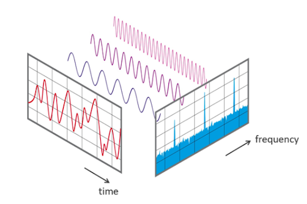

<link rel="stylesheet" href="css/quarto-revealjs-clean.css">

<section data-background-color="#107895">

## Theory of distributions

Jan Riopedre, Arnau Rojals and F. Javier Rodríguez

</section>

---

<section data-auto-animate data-transition-speed="fast" data-background-color="#107895">
  <h3> Example</h3>
   <h3> Fourier Transform</h3>
</section>

---

<section data-auto-animate data-transition-speed="fast">
   <h3> Fourier Transform</h3>
   

   
   

   
720 x 1280 = 921600 coefficients

</section>

---

<section data-auto-animate data-transition-speed="fast">
   <h3> Fourier Transform</h3>
   

      
      
   

</section>

---

<section data-auto-animate data-transition-speed="fast">
   <h2>n = 2</h2>
   

      
      
      
      
   

</section>

---

<section data-auto-animate data-transition-speed="fast">
   <h2>n = 4</h2>
   

      
      
      
      
   

</section>

---

<section data-auto-animate data-transition-speed="fast">
   <h2>n = 8</h2>
   

      
      
      
      
   

</section>

---

<section data-auto-animate data-transition-speed="fast">
   <h2>n = 16</h2>
   

      
      
      
      
   

</section>

---

<section data-auto-animate data-transition-speed="fast">
   <h2>n = 32</h2>
   

      
      
      
      
   

</section>

---

<section data-auto-animate data-transition-speed="fast">
   <h2>n = 64</h2>
   

      
      
      
      
   

</section>

---

<section data-auto-animate data-transition-speed="fast">
   <h2>n = 128</h2>
   

      
      
      
      
   

</section>

---

<section data-auto-animate data-transition-speed="fast">
   <h2>n = 256</h2>
   

      
      
      
      
   

</section>

---

<section data-auto-animate data-transition-speed="fast">
   <h2>n = 512</h2>
   

      
      
      
      
   

</section>

---

<section data-auto-animate data-transition-speed="fast">
   <h2>n = 1024</h2>
   

      
      
      
      
   

</section>

---

<section data-auto-animate data-transition-speed="fast">
   <h2>n = 2048</h2>
   

      
      
      
      
   

</section>

---

<section data-auto-animate data-transition-speed="fast">
   <h2>n = 4096</h2>
   

      
      
      
      
   

</section>

---

<section data-auto-animate data-transition-speed="fast">
   <h2>n = 8192</h2>
   

      
      
      
      
   

</section>

---

<section data-auto-animate data-transition-speed="fast">
   <h2>n = 16384</h2>
   

      
      
      
      
   

</section>

---

<section data-auto-animate data-transition-speed="fast">
   <h2>n = 32768</h2>
   

      
      
      
      
   

</section>

---

<section data-auto-animate markdown-block>

## Test Functions

</section>

---

<section data-auto-animate markdown-block>

## Test Functions

Motivated by $\delta(x)$ approach as multiplyng a 'suitably smooth' function.
</section>

---

<section data-auto-animate markdown-block>

## Test Functions

Motivated by $\delta(x)$ approach as multiplyng a  'suitably smooth'  function.
</section>

---

<section data-auto-animate markdown-block>

## Test Functions

We say that $\phi(x)$ is a test function  if:

- $\phi(x)$ is a $\mathcal{C}^{\infty}$ function
- $\phi(x)$ has compact support.

 Condition 1 implies that all the derivatives of a test function are also test functions

 As a note, test functions do   exist.

</section>

---

<section data-auto-animate markdown-block>

## Test Functions

Example:
$$\Phi(x) = \begin{cases}0 \hspace{40.5mm}x\leq 0\\e^{-1/x} \hspace{20mm}x > 0\end{cases}$$

   It is $\mathcal{C}^\infty$, but it does not have compact support

 
 
$$\Rightarrow \phi(x) = \Phi(x)\Phi(1-x)$$

</section>

---

<section data-auto-animate markdown-block>

## Test Functions

Convergence for $\{\phi_n(x)\}$:

We say that $\phi_n(x) \to 0$ as $n \to \infty$ if

- $\phi_n(x)$ and all its derivatives $\phi_n^{(m)}(x)$ tend to zero, uniformly in both $x$ and $m$

- There is an interval $(a, b)$ containing the support of all the $\phi_n$.

</section>

---

## The action of a test function

---

<section data-auto-animate data-transition-speed="fast">

## Action of $f$ on a test function $\phi(x)$

$\langle f, \phi \rangle = \int_{-\infty}^{\infty} f(x) \phi(x) dx$

::: {.fragment}
Properties

- $\langle f, a\phi+b\psi\rangle = a\langle f, \phi\rangle + b \langle f, \psi\rangle$
- $$\text{if } \phi_n(x) \to 0 \text{ then } \langle f, \phi_n \rangle \to 0$$
:::

</section>

---

<section data-auto-animate markdown-block>

## Distribution

</section>

---

<section data-auto-animate >

## Distribution

Motivation \
Definition\
Linearity and continuity\
The delta function  \
Properties  
The derivative of a distribution  

</section>

---

<section data-auto-animate>

## Distribution

**Motivation** \
Definition\
Linearity and continuity  
The delta function  
Properties  
The derivative of a distribution  

**Why?**\
&nbsp;\
Take the of function further\
&nbsp;\
More broader and general

</section>

---

<section data-auto-animate markdown-block>

## Distribution

Motivation\
**Definition** \
Linearity and continuity  
The delta function  
Properties  
The derivative of a distribution  

&nbsp;

A **distribution** $( D )$ is a continuous linear map from the space of test functions to $( \mathbb{R} )$

$\mathcal{D} : \phi \mapsto \langle \mathcal{D}, \phi \rangle \in \mathbb{R}$

</section>

---

<section data-auto-animate markdown-block>

## Distribution

Motivation\
Definition \
**Linearity and continuity**\
The delta function  
Properties  
The derivative of a distribution  

- $ \langle \mathcal{D}, a \varphi + b \psi \rangle = a \langle \mathcal{D}, \varphi \rangle + b \langle \mathcal{D}, \psi \rangle $

- if $ \varphi_n(x) \to 0 \quad \text{as} \quad n \to \infty, $  
  then $ \langle \mathcal{D}, \varphi_n \rangle \to 0 $

</section>

---

<section data-auto-animate markdown-block>

## Distribution

Motivation\
Definition \
Linearity and continuity\
**The delta function** \
Properties  
The derivative of a distribution  

$
\langle \delta, \phi \rangle = \phi(0)
$

</section>

---

<section data-auto-animate markdown-block>

## Distribution

Motivation\
Definition \
Linearity and continuity\
**The delta function** \
Properties  
The derivative of a distribution  

$
\langle \delta, \phi \rangle = \phi(0)
$

$= \int_{-\infty}^{\infty} \delta(x) \phi(x) \, dx
$

</section>

---

<section data-auto-animate markdown-block>

## Distribution

Motivation\
Definition \
Linearity and continuity\
The delta function  
**Properties** \
The derivative of a distribution  

&nbsp;

- $ \langle \mathcal{D} + \mathcal{E}, \phi \rangle = \langle \mathcal{D}, \phi \rangle + \langle \mathcal{E}, \phi \rangle $
- $ \langle a \mathcal{D}, \phi \rangle = a \langle \mathcal{D}, \phi \rangle $
- $ \langle \mathcal{D}(x - a), \phi(x) \rangle = \langle \mathcal{D}(x), \phi(x + a) \rangle $
- $ \langle \mathcal{D}(ax), \phi(x) \rangle = \frac{1}{|a|} \langle \mathcal{D}, \phi(x/a) \rangle $
- $ \langle \Phi(x) \mathcal{D}(x), \phi(x) \rangle = \langle \mathcal{D}(x), \Phi(x) \phi(x) \rangle $

</section>

---

<section data-auto-animate markdown-block>

## Distribution

Motivation\
Definition \
Linearity and continuity\
The delta function  
Properties  
**The derivative of a distribution**

- $\langle \mathcal{D}^', \phi \rangle = -\langle \mathcal{D}, \phi' \rangle$

</section>

---

<section data-auto-animate markdown-block>

## Distribution

Motivation\
Definition \
Linearity and continuity\
The delta function  
Properties  
**The derivative of a distribution**

- $\langle \mathcal{D}^', \phi \rangle = -\langle \mathcal{D}, \phi' \rangle$

- **Example:** $\mathcal{H}'(x) = \delta(x)$

</section>

---

<section data-auto-animate markdown-block>

## Distribution

Motivation\
Definition \
Linearity and continuity\
The delta function  
Properties  
**The derivative of a distribution**

- $\langle \mathcal{D}^', \phi \rangle = -\langle \mathcal{D}, \phi' \rangle$

- **Example:** $\mathcal{H}'(x) = \delta(x)$

- $\langle \mathcal{D}^{(m)}(x),  \phi(x) \rangle = (-1)^m \langle \mathcal{D},  \phi^{(m)}(x) \rangle$

</section>

---

## Extensions of the theory of distributions

---

<section data-auto-animate markdown-block>

## More variables

&nbsp;

- **Multivariable test function**

    $$\mathcal{C}^{\infty} \text{ and with compact support in all the arguments}$$  

</section>

---

<section data-auto-animate markdown-block>

## More variables

- **Multivariable test function**

$$\mathcal{C}^{\infty} \text{ and with compact support in all the arguments}$$  

- **Multivariable distribution**

Continuous linear map from the space of multivariable test functions to real numbers

Example: $\langle \delta(\mathbf{x}), \phi(\mathbf{x}) \rangle = \phi(0)$

</section>

---

<section data-auto-animate markdown-block>

## More variables

- **Derivatives**

$$
\left\langle \frac{\partial \mathcal{D}}{\partial x_i}, \, \phi \right\rangle = - \left\langle \mathcal{D}, \, \frac{\partial \phi}{\partial x_i} \right\rangle
$$

$$
\nabla \wedge \nabla \mathcal{D} \equiv 0
$$

</section>

---

## Fourier transforms

- **Concept and deduction**

$$\hat{\phi}(k) = \int_{-\infty}^{\infty} \phi(x) e^{ikx} \, dx$$

---

<section data-auto-animate markdown-block>

## Fourier transforms

- **Tempered distributions**

Test functions before: with compact support and $\mathcal{C}^\infty$

</section>

---

<section data-auto-animate markdown-block>

## Fourier transforms

- **Tempered distributions**

Test functions before: <s>with compact support</s> and $\mathcal{C}^\infty$

&darr;

all the derivatives decay faster than any power of x

</section>

---

<section data-auto-animate markdown-block>

## Fourier transforms

- **Tempered distributions**

$$\phi(x) \text{ test function} \quad \Rightarrow \quad \hat{\phi}(k) \text{ test function}$$

$\hat{\phi}(k) = \int_{-\infty}^{\infty} \phi(x) e^{ikx} dx$

$\hat{\psi}(x) = \frac{1}{2\pi} \int_{-\infty}^{\infty} \psi(k) e^{-ikx} dk$

$\frac{d\hat{\phi}}{dx} = -ik\hat{\phi}$

$\hat{x\phi} = -i \frac{d\hat{\phi}}{dk}$

</section>

---

<section data-auto-animate markdown-block>

## Fourier transforms

- **Tempered distributions**

The action of the Fourier transform of an ordinary function on a test function:

$$\langle \hat{f}, \phi \rangle = \int_{-\infty}^{\infty} \left( \int_{-\infty}^{\infty} f(x)  e^{ikx}  dx \right) \phi(k) dk$$

$$
\hspace{27mm}= \int_{-\infty}^{\infty} \left( \int_{-\infty}^{\infty} \phi(k) e^{ikx} dk \right) f(x) dx
$$

$$
\hspace{-55mm}=  \langle f, \hat{\phi} \rangle.
$$

So we define: $\hspace{5mm} \langle \hat{\mathcal{D}}, \phi \rangle = \langle \mathcal{D}, \hat{\phi} \rangle$

$\hspace{68mm}\langle \check{\mathcal{D}}, \phi \rangle = \langle \mathcal{D}, \check{\phi} \rangle$

</section>

---

<section data-auto-animate markdown-block>

## Fourier transforms

- **Tempered distributions**

The Fourier transform of the derivative $\mathcal{D}' = \frac{d\mathcal{D}}{dx}$ is $-ik\hat{\mathcal{D}}$

$
\langle \hat{\mathcal{D}^'}, \phi \rangle = \langle \mathcal{D}', \hat{\phi} \rangle
$
$
= -\langle \mathcal{D}, \frac{d \hat{\phi}}{dk} \rangle
$
$
\hspace{28mm}= -\langle \mathcal{D}, ix \hat{\phi} \rangle \\
= \langle -ik \hat{\mathcal{D}}, \phi \rangle
$

So we define: $\hspace{5mm} \langle \hat{\mathcal{D}}, \phi \rangle = \langle \mathcal{D}, \hat{\phi} \rangle$

$\hspace{68mm}\langle \check{\mathcal{D}}, \phi \rangle = \langle \mathcal{D}, \check{\phi} \rangle$

</section>

---

<section data-auto-animate markdown-block>

## Fourier transforms

- **Two Examples**

</section>

---

<section data-auto-animate markdown-block>

## Fourier transforms

- **FT of delta**

Informally,

$$
\int_{-\infty}^{\infty} \delta(x) e^{ikx} dx = e^{ik \cdot 0} = 1
$$

Formally,

$$
\langle \hat{\delta}, \phi \rangle = \langle \delta, \hat{\phi} \rangle
= \hat{\phi}(0)$$
$$
= \int_{-\infty}^{\infty} \phi(x)  dx = \langle 1, \phi \rangle
$$

$$
\hat{\delta}(k) = 1
$$

</section>

---

<section data-auto-animate markdown-block>

## Fourier transforms

- **FT of 1**

For the inverse, we have:

$$
\check{\delta} = \frac{1}{2\pi} \int_{-\infty}^{\infty} \delta(k) e^{-ikx} \, dk \\
= \frac{1}{2\pi},
$$

Formally,

$$
\overset{({\check{\delta}}\hat)=\delta}{\Rightarrow} \quad \hat{1}(k) = 2\pi \delta(k)
$$

</section>

---

<section data-auto-animate markdown-block>

## Example: Heat Equation

Consider:

$$
\frac{\partial u}{\partial t} = \frac{\partial^2 u}{\partial x^2}, \quad -\infty < x < \infty, \quad t > 0,
$$

$$
u(x, 0) = \delta(x).
$$

Taking the Fourier transform in  $x$. The equation for $ \hat{u}(k, t)$ is:

$$
\frac{\partial \hat{u}}{\partial t} = -k^2 \hat{u}, \quad -\infty < k < \infty, \quad t > 0,
$$

$$
u(x, 0) = \delta(k) = 1.
$$

</section>

---

<section data-auto-animate markdown-block>

## Example: Heat Equation

Taking the Fourier transform in  $x$. The equation for $ \hat{u}(k, t)$ is:

$$
\frac{\partial \hat{u}}{\partial t} = -k^2 \hat{u}, \quad -\infty < k < \infty, \quad t > 0,
$$

$$
u(x, 0) = \delta(k) = 1.
$$

The solution is:

$$
\hat{u}(k, t) = exp(-k^2t) \Rightarrow
u(x, t) = \frac{1}{2\sqrt{\pi t}} exp(-x^2 / 4t).
$$

</section>

---

## Heat Equation Solution

<iframe src="https://javirm3.shinyapps.io/fourierheat/" width="100%" height="800"></iframe>

---

<section data-auto-animate data-transition-speed="fast" data-background-color="#107895">
  <h2>Questions?</h2>
</section>
