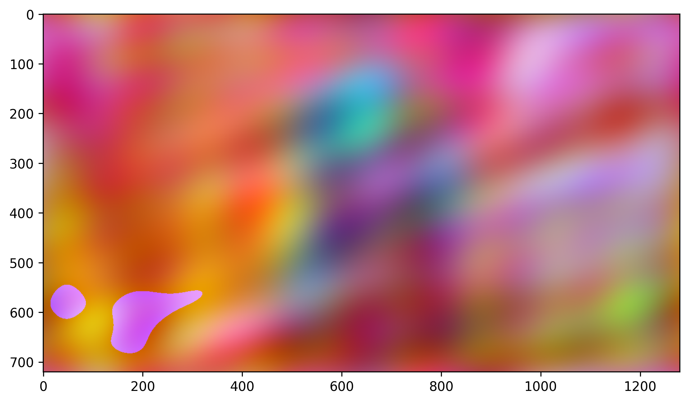

<link rel="stylesheet" href="css/quarto-revealjs-clean.css">

<section data-background-color="#107895">

## Theory of distributions

Jan Riopedre, Arnau Rojals and F. Javier Rodríguez

</section>

---

<section data-auto-animate data-transition-speed="fast" data-background-color="#107895">
  <h3> Example</h3>
   <h3> Fourier Transform</h3>
</section>

<section data-auto-animate data-transition-speed="fast">
   <h3> Fourier Transform</h3>
   

   
   

   
720 x 1280 = 921600 coefficients

</section>
<section data-auto-animate data-transition-speed="fast">
   <h3> Fourier Transform</h3>
   

      
      
   

</section>

<section data-auto-animate data-transition-speed="fast">
   <h2>n = 2</h2>
   

      
      
      
      
   

</section>

<section data-auto-animate data-transition-speed="fast">
   <h2>n = 4</h2>
   

      
      
      
      
   

</section>

<section data-auto-animate data-transition-speed="fast">
   <h2>n = 8</h2>
   

      
      
      
      
   

</section>

<section data-auto-animate data-transition-speed="fast">
   <h3>n = 16</h3>
   

      
      
      
      
   

</section>

<section data-auto-animate data-transition-speed="fast">
   <h2>n = 32</h2>
   

      
      
      
      
   

</section>

<section data-auto-animate data-transition-speed="fast">
   <h2>n = 64</h2>
   

      
      
      
      
   

</section>

<section data-auto-animate data-transition-speed="fast">
   <h2>n = 128</h2>
   

      
      
      
      
   

</section>

<section data-auto-animate data-transition-speed="fast">
   <h2>n = 256</h2>
   

      
      
      
      
   

</section>

<section data-auto-animate data-transition-speed="fast">
   <h2>n = 512</h2>
   

      
      
      
      
   

</section>

<section data-auto-animate data-transition-speed="fast">
   <h2>n = 1024</h2>
   

      
      
      
      
   

</section>

<section data-auto-animate data-transition-speed="fast">
   <h2>n = 2048</h2>
   

      
      
      
      
   

</section>

<section data-auto-animate data-transition-speed="fast">
   <h2>n = 4096</h2>
   

      
      
      
      
   

</section>

<section data-auto-animate data-transition-speed="fast">
   <h2>n = 8192</h2>
   

      
      
      
      
   

</section>

<section data-auto-animate data-transition-speed="fast">
   <h2>n = 16384</h2>
   

      
      
      
      
   

</section>

<section data-auto-animate data-transition-speed="fast">
   <h2>n = 32768</h2>
   

      
      
      
      
   

</section>

---

## The action of a test function

---

<section data-auto-animate data-transition-speed="fast">

## Action of $f$ on a test function $\phi(x)$

$\langle f, \phi \rangle = \int_{-\infty}^{\infty} f(x) \phi(x) \, dx$

::: {.fragment}
Properties

- $\langle f, a\phi+b\psi\rangle = a\langle f, \phi\rangle + b \langle f, \psi\rangle$
  - if &nbsp;&nbsp;&nbsp;&nbsp;&nbsp;&nbsp;&nbsp; &nbsp;&nbsp;$\phi_n(x)\to 0$
  - then $\langle f,\phi _n\rangle \to 0$
:::

</section>

---

<section data-auto-animate markdown-block>

## Distribution

</section>

<section data-auto-animate markdown-block>

## Distribution

Motivation \
Definition\
Linearity and continuity
The delta function  
Properties  
The derivative of a distribution  
</section>

<section data-auto-animate markdown-block>

## Distribution

**Motivation** \
Definition\
Linearity and continuity  
The delta function  
Properties  
The derivative of a distribution  

**Why?**\
&nbsp;\
Take the of function further\
&nbsp;\
More broader and general

</section>

<section data-auto-animate markdown-block>

## Distribution

Motivation\
**Definition** \
Linearity and continuity  
The delta function  
Properties  
The derivative of a distribution  

A **distribution** $( D )$ is a continuous linear map from the space of test functions to $( \mathbb{R} )$

$\mathcal{D} : \phi \mapsto \langle \mathcal{D}, \phi \rangle \in \mathbb{R}$

</section>

<section data-auto-animate markdown-block>

## Distribution

Motivation\
Definition \
**Linearity and continuity**\
The delta function  
Properties  
The derivative of a distribution  

- $ \langle \mathcal{D}, a \varphi + b \psi \rangle = a \langle \mathcal{D}, \varphi \rangle + b \langle \mathcal{D}, \psi \rangle $

- if $ \varphi_n(x) \to 0 \quad \text{as} \quad n \to \infty, $  
  then $ \langle \mathcal{D}, \varphi_n \rangle \to 0 $

</section>

<section data-auto-animate markdown-block>

## Distribution

Motivation\
Definition \
Linearity and continuity\
**The delta function** \
Properties  
The derivative of a distribution  

$
\langle \delta, \phi \rangle = \phi(0)
$

</section>

<section data-auto-animate markdown-block>

## Distribution

Motivation\
Definition \
Linearity and continuity\
**The delta function** \
Properties  
The derivative of a distribution  

$
\langle \delta, \phi \rangle = \phi(0)
$
$= \int_{-\infty}^{\infty} \delta(x) \phi(x) \, dx
$

</section>

<section data-auto-animate markdown-block>

## Distribution

Motivation\
Definition \
Linearity and continuity\
The delta function  
**Properties** \
The derivative of a distribution  

&nbsp;

- $ \langle \mathcal{D} + \mathcal{E}, \phi \rangle = \langle \mathcal{D}, \phi \rangle + \langle \mathcal{E}, \phi \rangle $
- $ \langle a \mathcal{D}, \phi \rangle = a \langle \mathcal{D}, \phi \rangle $
- $ \langle \mathcal{D}(x - a), \phi(x) \rangle = \langle \mathcal{D}(x), \phi(x + a) \rangle $
- $ \langle \mathcal{D}(ax), \phi(x) \rangle = \frac{1}{|a|} \langle \mathcal{D}, \phi(x/a) \rangle $
- $ \langle \Phi(x) \mathcal{D}(x), \phi(x) \rangle = \langle \mathcal{D}(x), \Phi(x) \phi(x) \rangle $

</section>

<section data-auto-animate markdown-block>

## Distribution

Motivation\
Definition \
Linearity and continuity\
The delta function  
Properties  
**The derivative of a distribution**

- $\langle \mathcal{D}^', \phi \rangle = -\langle \mathcal{D}, \phi' \rangle$

</section>

<section data-auto-animate markdown-block>

## Distribution

Motivation\
Definition \
Linearity and continuity\
The delta function  
Properties  
**The derivative of a distribution**

- $\langle \mathcal{D}^', \phi \rangle = -\langle \mathcal{D}, \phi' \rangle$

- **Example:** $\mathcal{H}'(x) = \delta(x)$

</section>
<section data-auto-animate markdown-block>

## Distribution

Motivation\
Definition \
Linearity and continuity\
The delta function  
Properties  
**The derivative of a distribution**

- $\langle \mathcal{D}^', \phi \rangle = -\langle \mathcal{D}, \phi' \rangle$

- **Example:** $\mathcal{H}'(x) = \delta(x)$

- $\langle \mathcal{D}^{(m)}(x), \, \phi(x) \rangle = (-1)^m \langle \mathcal{D}, \, \phi^{(m)}(x) \rangle$

</section>

---

## Heat Equation Solution

<iframe src="https://javirm3.shinyapps.io/fourierheat/" width="100%" height="800"></iframe>
